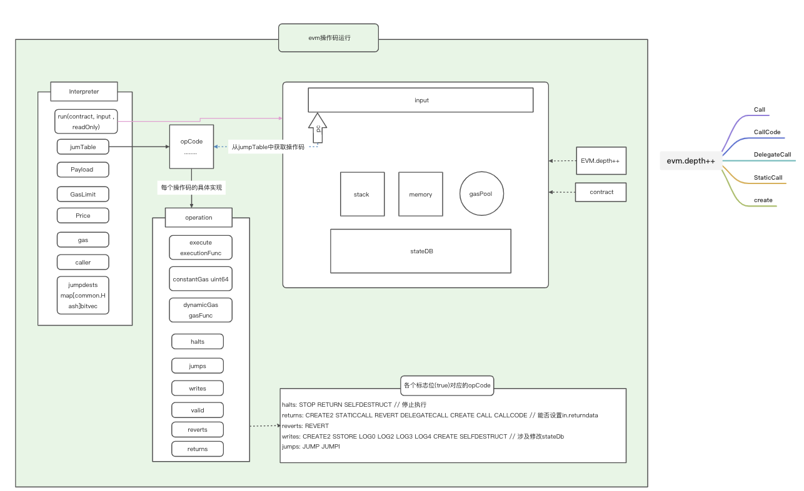

# EVM虚拟机2 源码解析

# 代码组织结构
- core/
   - state_process.go EVM入口函数
   - state_Transaction.go 调用EVM前的准备

- core/vm

  - analysis.go 实现了合约代码扫描检测的工具函数
  - common.go 实现了一些公用的辅助函数
  - contract.go 实现了**contract 这个重要的结构及其方法**
  - contracts.go 实现了主要预编译合约
  - evm.go 实现了**evm虚拟机的结构定义和相关的重要方法**
  - gas_table.go 实现了各类不同指令所需要的**动态计算gas的方法**
  - instructions.go 实现了各类指令的实际执行代码。
  - interface.go 定义了StatDB 接口和 Callcontext 接口
  - interpreter.go 实现了Opcode解释器。Opcode的**解释执行都在这里**
  - intpool.go 大整数的缓冲池，主要是为了优化速度，避免重复计算。
  - jump_table.go **非常重要的lookup table**，针对每一个具体的opCode， 分别指向了gas_table，和instructions中的具体实现。解释器直接会根据opCode来进行查找。
  - memory.go 实现了EVM中的临时memory存储。
  - opcodes.go 定义了所有的opCode以及其和字符串的映射表
  - stack.go EVM中所用到的栈的实现。 

- params/

  - protocol_params 定义了各个不**同代际的EVM各类操作的Gas费用标准**

  - gas_table.go 定义了各个不**同代际的EVM特定操作的Gas费用标准**

    

## 1.1. 执行流程

### 1.1EVM虚拟机入口

#### 区块和状态树和交易的关系

新的区块将以上个区块最新的的状态树为基础，执行自己区块内所有交易，并且不断修改state tree，在所有交易执行完成后会生成新的state tree,这个新的状态树的tree root会被打包进区块，参与区块共识流程


图：world state

入口函数位于go-ethereum/core/state_processor.go中的process()方法里的ApplyTransaction()函数，该函数会真正执行以太坊的每一个交易

```go
func (p *StateProcessor) Process(block *types.Block, statedb *state.StateDB, cfg vm.Config) (types.Receipts, []*types.Log, uint64, error) {
   var (
      receipts types.Receipts
      usedGas  = new(uint64)
      header   = block.Header()
      allLogs  []*types.Log
      gp       = new(GasPool).AddGas(block.GasLimit())
   )
   // Mutate the block and state according to any hard-fork specs
   if p.config.DAOForkSupport && p.config.DAOForkBlock != nil && p.config.DAOForkBlock.Cmp(block.Number()) == 0 {
      misc.ApplyDAOHardFork(statedb)
   }
   // Iterate over and process the individual transactions
   for i, tx := range block.Transactions() {
      statedb.Prepare(tx.Hash(), block.Hash(), i)
      /* EVM 入口*/
      receipt, err := ApplyTransaction(p.config, p.bc, nil, gp, statedb, header, tx, usedGas, cfg)
      /*注意这里任何一个交易执行失败，都会该状态转换函数都会直接返回err*/
      if err != nil {
         return nil, nil, 0, err
      }
      receipts = append(receipts, receipt)
      allLogs = append(allLogs, receipt.Logs...)
   }
   // Finalize the block, applying any consensus engine specific extras (e.g. block rewards)
   p.engine.Finalize(p.bc, header, statedb, block.Transactions(), block.Uncles())

   return receipts, allLogs, *usedGas, nil
}
```

go-ethereum/core/state_processor.go中的ApplyTransaction()函数:

1. 生成Message结构体
2. 新建EVM.Context,记录了区块的关键属性
3. 新建EVM实例
4. 通过EVM实例执行交易
5. 计算总的gas使用量
6. 为执行成功的交易生成receipt

```go
func ApplyTransaction(config *params.ChainConfig, bc ChainContext, author *common.Address, gp *GasPool, statedb *state.StateDB, header *types.Header, tx *types.Transaction, usedGas *uint64, cfg vm.Config) (*types.Receipt, error) {
   /*
   1）签名
   2）将transition 转换成 message  message.data = tx.txdata.payload 交易中的有效数据（合约代码）
   */
   msg, err := tx.AsMessage(types.MakeSigner(config, header.Number))
   if err != nil {
      return nil, err
   }
   // Create a new context to be used in the EVM environment
   /* 新建EVM.Context*/
   context := NewEVMContext(msg, header, bc, author)
   // Create a new environment which holds all relevant information
   // about the transaction and calling mechanisms.
   /*
      新建EVM实例
         （也创建了EVM解释器--解释器中会根据cfg的配置参数选择对应的jump table）
   */
   vmenv := vm.NewEVM(context, statedb, config, cfg)
   // Apply the transaction to the current state (included in the env)
   /*
   让 EVM 执行该交易
   Params
   @ vmenv：虚拟机实例
   @ msg:transaction签名转换后的Message
   @ gp:gaspool
   */
   _, gas, failed, err := ApplyMessage(vmenv, msg, gp)  /*ApplyMessage 其实是首先生成了一个StateTransition的实例， 然后调用其TransitionDb方法开始交给虚拟机执行*/
   if err != nil {
      return nil, err
   }
   // Update the state with pending changes
   var root []byte
   if config.IsByzantium(header.Number) {
      statedb.Finalise(true)
   } else {
      root = statedb.IntermediateRoot(config.IsEIP158(header.Number)).Bytes()
   }
   *usedGas += gas

   // Create a new receipt for the transaction, storing the intermediate root and gas used by the tx
   // based on the eip phase, we're passing whether the root touch-delete accounts.
   receipt := types.NewReceipt(root, failed, *usedGas)
   receipt.TxHash = tx.Hash()
   receipt.GasUsed = gas
   // if the transaction created a contract, store the creation address in the receipt.
   if msg.To() == nil {
      receipt.ContractAddress = crypto.CreateAddress(vmenv.Context.Origin, tx.Nonce())
   }
   // Set the receipt logs and create a bloom for filtering
   receipt.Logs = statedb.GetLogs(tx.Hash())
   receipt.Bloom = types.CreateBloom(types.Receipts{receipt})
   receipt.BlockHash = statedb.BlockHash()
   receipt.BlockNumber = header.Number
   receipt.TransactionIndex = uint(statedb.TxIndex())

   return receipt, err
}
```


### 1.2 通过EVM执行交易

接下来我们关注EVM是如何执行交易的，其具体函数是上一步的ApplyMessage(vmenv, msg, gp) ，三个入参分别是，evm实例、Message(由transaction转换而来)、gaspool（block的gas limit）


```go
func ApplyMessage(evm *vm.EVM, msg Message, gp *GasPool) ([]byte, uint64, bool, error) {
   return NewStateTransition(evm, msg, gp).TransitionDb()
}
```

#### 1)我们可以看到这一步首先是通过入参生成StateTransition结构体

```go
// NewStateTransition initialises and returns a new state transition object.
func NewStateTransition(evm *vm.EVM, msg Message, gp *GasPool) *StateTransition {
   return &StateTransition{
      gp:       gp,
      evm:      evm,
      msg:      msg,
      gasPrice: msg.GasPrice(),
      value:    msg.Value(),
      data:     msg.Data(),
      state:    evm.StateDB,
   }
}
```

#### 2)调用StateTransition的TransitionDb()方法


```go
func (st *StateTransition) TransitionDb() (ret []byte, usedGas uint64, failed bool, err error) {
   /*1.检查nonce是否符合要求
       检查账户是否足够支付gas fee*/
   if err = st.preCheck(); err != nil {
      return
   }
   msg := st.msg
   //记录发起这笔交易的发起人地址
   sender := vm.AccountRef(msg.From())
   homestead := st.evm.ChainConfig().IsHomestead(st.evm.BlockNumber)
   istanbul := st.evm.ChainConfig().IsIstanbul(st.evm.BlockNumber) // 是不是伊斯坦布尔升级后的版本

   /*如果 msg.To()==nil 代表创建合约*/
   contractCreation := msg.To() == nil

   /* Pay intrinsic gas  计算固有成本的gas */TransitionDb
   gas, err := IntrinsicGas(st.data, contractCreation, homestead, istanbul)
   if err != nil {
      return nil, 0, false, err
   }
  /*st.gas 减去固有成本gas*/
   if err = st.useGas(gas); err != nil {
      return nil, 0, false, err
   }

   var (
      evm = st.evm
      // vm errors do not effect consensus and are therefor
      // not assigned to err, except for insufficient balance
      // error.
      vmerr error
   )

   /*判断合约类型
      ---接下来就是调用虚拟机的操作了
   */
   if contractCreation {
      /* 进行创建合约操作*/
      /*st.data = message.data() = tx.txdata.payload*/
      ret, _, st.gas, vmerr = evm.Create(sender, st.data, st.gas, st.value)
   } else {
      // Increment the nonce for the next transaction

      st.state.SetNonce(msg.From(), st.state.GetNonce(sender.Address())+1)
      ret, st.gas, vmerr = evm.Call(sender, st.to(), st.data, st.gas, st.value)
   }

   /*如果虚拟机执行发生错误，判断错误类型，如果是账户余额不足则直接停止该进程，其他错误继续执行*/
   if vmerr != nil {
      log.Debug("VM returned with error", "err", vmerr)
      // The only possible consensus-error would be if there wasn't
      // sufficient balance to make the transfer happen. The first
      // balance transfer may never fail.
      if vmerr == vm.ErrInsufficientBalance {
         return nil, 0, false, vmerr
      }
   }

   /*退回多余的gas*/
   st.refundGas()
   /*向打包该交易的矿工账户添加手续费*/
   st.state.AddBalance(st.evm.Coinbase, new(big.Int).Mul(new(big.Int).SetUint64(st.gasUsed()), st.gasPrice))

   return ret, st.gasUsed(), vmerr != nil, err
}
```

##### 2.1)检查nonce是否符合要求 ，如果符合要求，再检查账户是否足够支付gas fee

```go
/*随机数检查*/
func (st *StateTransition) preCheck() error {
   // Make sure this transaction's nonce is correct.
   if st.msg.CheckNonce() {
      nonce := st.state.GetNonce(st.msg.From())
      if nonce < st.msg.Nonce() {
         return ErrNonceTooHigh
      } else if nonce > st.msg.Nonce() {
         return ErrNonceTooLow
      }
   }
   return st.buyGas()
}
```

​	计算 账户余额 >= gas num*gas price

```go
func (st *StateTransition) buyGas() error {
   /*1.第一步是计算这个交易消耗的eth数量 = 交易发起者提供的gas数量和gas价格。*/
   mgval := new(big.Int).Mul(new(big.Int).SetUint64(st.msg.Gas()), st.gasPrice)
   /*2.判断当前账户的余额是否足够支付这笔eth*/
   if st.state.GetBalance(st.msg.From()).Cmp(mgval) < 0 {
      return errInsufficientBalanceForGas
   }
   /*3. 从整个区块的Gas.pool中扣除这个交易预计消耗的Gas数量*/
   if err := st.gp.SubGas(st.msg.Gas()); err != nil {
      return err
   }
   /*4.这部分Gas数量转移到了st.gas 中， 这里会在后续的evm执行中被不停的扣除。 */
   st.gas += st.msg.Gas()
   /*5.在st.initialGas中记录最初分配的gas数量。 */
   st.initialGas = st.msg.Gas()
   /*6.这里最为关键， 从发起者账户中扣除对应的eth数量。 （当然如果中途出错，一切都有可能回滚）*/
   st.state.SubBalance(st.msg.From(), mgval)
   return nil
}
```

##### 2.2)计算固有成本的gas 

> 交易的固有成本必须小于该交易设置的 gas 上限
> 在前一篇博文中，我们说明了为什么使用以太坊需要付费，以及 gas 的概念。总的来说，每一笔交易都有与之关联的 gas ——发送一笔交易的成本包含两部分：固有成本和执行成本。
>
> 执行成本根据该交易需要使用多少以太坊虚拟机（EVM）的资源来运算而定，执行一笔交易所需的操作越多，则它的执行成本就越高。
>
> 固有成本由交易的负载（ payload ）决定，交易负载分为以下三种负载：
>
>    >如果该交易是为了创建智能合约，则负载就是创建智能合约的 EVM 代码
>    >如果该交易是为了调用智能合约的函数，则负载就是执行消息的输入数据
>    >如果该交易只是单纯在两个账户间转账，则负载为空
>
> 设 Nzeros 代表交易负载中，字节为 0 的字节总数；Nnonzeros 代表交易负载中，字节不为 0 的字节总数。
> 可以通过下列公式计算出该交易的固有成本（黄皮书 6.2 章，方程式 54、55 和 56）：
>
> 固有成本 = Gtransaction + Gtxdatazero * Nzeros + Gtxdatanonzero * Nnonzeros + Gtxcreate
>
> 在黄皮书的附录 G 中，可以看到一份创建和执行交易的相关成本的费用表。与固有成本相关的内容如下：
>
> Gtransaction = 21,000 Wei
> Gtxcreate = 32,000 Wei
> Gtxdatazero = 4 Wei
> Gtxdatanonzero = 68 Wei (在伊斯坦布尔升级时会改为 16 wei)

```go
func IntrinsicGas(data []byte, contractCreation, isHomestead bool, isEIP2028 bool) (uint64, error) {
   // Set the starting gas for the raw transaction
   /*1.首先如果是创建合约的交易起步价为53000gas, 如果是普通合约调用交易则为21000gas.*/
   var gas uint64
   if contractCreation && isHomestead {
      gas = params.TxGasContractCreation
   } else {
      gas = params.TxGas
   }
   // Bump the required gas by the amount of transactional data
   if len(data) > 0 {
      // Zero and non-zero bytes are priced differently
      var nz uint64
      /*2.其次计算输入的合约数据中的非零字节和零自己的数量*/
      for _, byt := range data {
         if byt != 0 {
            nz++
         }
      }
      // Make sure we don't exceed uint64 for all data combinations
      nonZeroGas := params.TxDataNonZeroGasFrontier
      if isEIP2028 {
         nonZeroGas = params.TxDataNonZeroGasEIP2028
      }

      // 1<<64-1 [大于] 不是0的字节数 x 68
      if (math.MaxUint64-gas)/nonZeroGas < nz {
         return 0, vm.ErrOutOfGas
      }
      /*
      3.
      分别计算其gas消耗。 零字节每字节4gas， 非零字节每字节68gas。
       零字节较为便宜是因为RLP编码协议可以压缩0字节。
      在向Trie 存储这些数据时，零字节占用空间很少。
      */
      gas += nz * nonZeroGas

      // 0的数量
      z := uint64(len(data)) - nz
      if (math.MaxUint64-gas)/params.TxDataZeroGas < z {
         return 0, vm.ErrOutOfGas
      }
      /*4 检查是否整数溢出，同时把所消耗的gas加总。*/
      gas += z * params.TxDataZeroGas
   }
   return gas, nil
}
```

##### 2.3）st.gas = st.gas - IntrinsicGas

##### 2.4) 进行合约创建或者合约调用 (EVM执行字节码)

##### 2.5) 将未使用完的st.gas退还到发起者账户中

##### 2.6）向矿工账户添加交易手续费


### 1.3 进行合约创建或者合约调用 (EVM执行字节码)

在我们上文所述的StateTransition.TransitionDb()的方法的第4步会进行合约创建或者合约调用，具体代码如下所示

```go
func (st *StateTransition) TransitionDb() (ret []byte, usedGas uint64, failed bool, err error) {
	....
	if contractCreation {
		/* 进行创建合约操作*/
		/*st.data = message.data() = tx.txdata.payload*/
		ret, _, st.gas, vmerr = evm.Create(sender, st.data, st.gas, st.value)
	} else {
		// Increment the nonce for the next transaction

		st.state.SetNonce(msg.From(), st.state.GetNonce(sender.Address())+1)
		ret, st.gas, vmerr = evm.Call(sender, st.to(), st.data, st.gas, st.value)
	}
	
	...
}
```

其中contractCreation是通过contractCreation := msg.To() == nil 来赋值的，也就意味着，如果一个交易没有目的地址，那么他就是创建合约的交易

#### 1.3.1合约创建

计算合约地址

```go
func (evm *EVM) Create(caller ContractRef, code []byte, gas uint64, value *big.Int) (ret []byte, contractAddr common.Address, leftOverGas uint64, err error) {
   // 通过nonce 和 调用者地址创建交易
   contractAddr = crypto.CreateAddress(caller.Address(), evm.StateDB.GetNonce(caller.Address()))
   return evm.create(caller, &codeAndHash{code: code}, gas, value, contractAddr)
}
```


我们都知道以太坊的账户分为普通账户和合约账户，其结构体如下所示:

> ```go
> // core/state/state_object.go:100
> type Account struct {
>     Nonce    uint64
>     Balance  *big.Int
>     Root     common.Hash
>     CodeHash []byte
> }
> ```
>
> 也就意味着账户拥有4个关键属性：
>
> - 账户随机数
> - 账户余额
> - 账户storage trie root
> - 合约code hash


图：以太坊状态树


众所周知以太坊有三棵树，状态树、交易树、收据树；这里我们主要关注状态树，我们可以发现状态树的每个叶子结点其实都是一个Account，同时如果账户是合约账户，那么他可以通过将codehash作为key在以太坊的leveldb中找到对应的contract code,同理他也可以通过storageroot在leveldb中找到对应的storage trie ,这里要注意每个合约账户都有自己的storage trie,我们在写solidity 中将变量存储位置声明为storage时就是将变量存储在合约账户的storage trie 中，因此storage trie 不是一成不变的，它会随着新的存储变量进入而添加新的节点，因而storage trie root 也会不断改变，但是最新的storage trie root 会被记录在合约账户中


#### 创建合约代码中的涉及以太坊状态树的写操作

**evm.StateDB.SetNonce(caller.Address(), nonce+1)**

设置合约账户随机数

 **contractHash := evm.StateDB.GetCodeHash(address)**
   **if evm.StateDB.GetNonce(address) != 0 || (contractHash != (common.Hash{}) && contractHash != emptyCodeHash)** 

因为是新创建的账户，所以通过state tree 查询得到的nonce值应该为0，contractHash也应该为空，否则证明该账户已经存在

**evm.StateDB.CreateAccount(address)** 

创建合约账户

 **evm.Transfer(evm.StateDB, caller.Address(), address, value)**

改变合约账户余额，这个实际上是我们在写solidity中如果在创建合约的过程中同时向刚创建的合约传入一定数量的eth，也即msg.value不等于0，而这个msg.value 实际上就是通过这个函数传递到新创建的合约账户内的

**contract.SetCodeOptionalHash(&address, codeAndHash) **  

codeAndHash 中包含code和codeHash

**evm.StateDB.SetCode(address, ret)** 

这一步将部署完contract剩余的code和合约账户进行进行配对并存储到leveldb中


#### 以太坊中如果交易执行失败如何回滚

29行: snapshot := evm.StateDB.Snapshot()

97行:evm.StateDB.RevertToSnapshot(snapshot)

我们可以看到在29行对以太坊的SateDB进行了一次快照，97行判断出现错误则可以回滚回29行的状态

因此


```go
// create creates a new contract using code as deployment code.
/*address 是由外部传过来的为该合约生成的合约*/
func (evm *EVM) create(caller ContractRef, codeAndHash *codeAndHash, gas uint64, value *big.Int, address common.Address) ([]byte, common.Address, uint64, error) {
   /*1.判断调用的深度是否超过最大限制1024，因为合约中是允许再次创建新的别的合约*/
   if evm.depth > int(params.CallCreateDepth) {
      return nil, common.Address{}, gas, ErrDepth
   }

   /*2.判断调用发起地址是否有足够的余额来转账*/
   if !evm.CanTransfer(evm.StateDB, caller.Address(), value) {
      return nil, common.Address{}, gas, ErrInsufficientBalance
   }

   /*3.调用发起地址nonce+1 表示调用发起地址已经完成一次交易。（当然如果中途出错，一切都有可能回滚）*/
   nonce := evm.StateDB.GetNonce(caller.Address())
   evm.StateDB.SetNonce(caller.Address(), nonce+1)

   /*
   4.检测所创建的合约地址是否唯一.以下任何一个条件被触发都会导致出错返回！
      1)该合约地址的nonce不为0. 表示该地值已经被初始化过了
      2)该合约所关联的codehash 不是hash类型，或者hash值不是keccak256（nil）也就是空的hash值。表示这里实际已经关联了合约代码。
   */
   contractHash := evm.StateDB.GetCodeHash(address)
   if evm.StateDB.GetNonce(address) != 0 || (contractHash != (common.Hash{}) && contractHash != emptyCodeHash) {
      return nil, common.Address{}, 0, ErrContractAddressCollision
   }
   // Create a new account on the state
   /*快照，用于回滚*/
   snapshot := evm.StateDB.Snapshot()
   /*
   5.在Trie对象中使用这个地址来创建对应的账户，并且nonce初始值为1表示初始化。
   */
   evm.StateDB.CreateAccount(address) //创建合约账户
   if evm.chainRules.IsEIP158 {
      evm.StateDB.SetNonce(address, 1)
   }
   /*
   6.把调用发起者转账的额度发送到这个合约地址
   */
   evm.Transfer(evm.StateDB, caller.Address(), address, value)

   // Initialise a new contract and set the code that is to be used by the EVM.
   // The contract is a scoped environment for this execution context only.
   /*
   7.生成Contract 同时设置Contract的关键属性
   */
   contract := NewContract(caller, AccountRef(address), value, gas) //生成合约实例
   /*
   7。1 配置contract的三个属性
   c.Code = codeAndHash.code
   c.CodeHash = codeAndHash.hash
   c.CodeAddr = addr
   */
   contract.SetCodeOptionalHash(&address, codeAndHash) //设置合约代码  çcodeAndHash中有合约源码

   // evm.vmConfig.NoRecursion 递归标志位
   if evm.vmConfig.NoRecursion && evm.depth > 0 {
      return nil, address, gas, nil
   }

   if evm.vmConfig.Debug && evm.depth == 0 {
      evm.vmConfig.Tracer.CaptureStart(caller.Address(), address, true, codeAndHash.code, gas, value)
   }
   start := time.Now()

   /*
   7.
   调用解释器来运行部署代码+构造函数，
   并返回合约的主体代码。
   */
   ret, err := run(evm, contract, nil, false)  //==》调用合约解释器的interpreter.Run(contract, input, readOnly)

   // check whether the max code size has been exceeded
   /*8. 检测代码大小是否超过了最大限制24567*/
   maxCodeSizeExceeded := evm.chainRules.IsEIP158 && len(ret) > params.MaxCodeSize
   // if the contract creation ran successfully and no errors were returned
   // calculate the gas required to store the code. If the code could not
   // be stored due to not enough gas set an error and let it be handled
   // by the error checking condition below.
   /*9.如果一切都顺利，则计算存储改代码所需要消耗的gas， 每字节200Gas*/
   if err == nil && !maxCodeSizeExceeded {
      createDataGas := uint64(len(ret)) * params.CreateDataGas
      /*10. 从已分配的Gas中扣除 9 计算消耗的gas。*/
      if contract.UseGas(createDataGas) {
         /*11.如果成功扣除则向Trie对象中存储合约的主体代码，供后续的交易来调用。*/
         evm.StateDB.SetCode(address, ret)
      } else {
         err = ErrCodeStoreOutOfGas
      }
   }

   // When an error was returned by the EVM or when setting the creation code
   // above we revert to the snapshot and consume any gas remaining. Additionally
   // when we're in homestead this also counts for code storage gas errors.
   /*12.如果过程中发生任何错误，关于Trie对象和gas计费相关的修改都会回滚。*/
   if maxCodeSizeExceeded || (err != nil && (evm.chainRules.IsHomestead || err != ErrCodeStoreOutOfGas)) {
      evm.StateDB.RevertToSnapshot(snapshot)
      if err != errExecutionReverted {
         contract.UseGas(contract.Gas)
      }
   }
   // Assign err if contract code size exceeds the max while the err is still empty.
   if maxCodeSizeExceeded && err == nil {
      err = errMaxCodeSizeExceeded
   }
   if evm.vmConfig.Debug && evm.depth == 0 {
      evm.vmConfig.Tracer.CaptureEnd(ret, gas-contract.Gas, time.Since(start), err)
   }
   return ret, address, contract.Gas, err

}
```

#### contract里的属性的值是如何传递的


### 1.3.2 合约调用

```go
func (evm *EVM) Call(caller ContractRef, addr common.Address, input []byte, gas uint64, value *big.Int) (ret []byte, leftOverGas uint64, err error) {
   /*1.判断调用的深度是否超过最大限制1024。*/
   if evm.vmConfig.NoRecursion && evm.depth > 0 {
      return nil, gas, nil
   }

   // Fail if we're trying to execute above the call depth limit
   if evm.depth > int(params.CallCreateDepth) {
      return nil, gas, ErrDepth
   }
   // Fail if we're trying to transfer more than the available balance
   /*2.判断调用发起地址是否有足够的余额来转账*/
   if !evm.Context.CanTransfer(evm.StateDB, caller.Address(), value) {
      return nil, gas, ErrInsufficientBalance
   }

   var (
      to       = AccountRef(addr)
      snapshot = evm.StateDB.Snapshot()
   )
   /*3.判断当前规范链数据库Trie中是否存在此地址。*/
   if !evm.StateDB.Exist(addr) {
      precompiles := PrecompiledContractsHomestead
      if evm.chainRules.IsByzantium {
         precompiles = PrecompiledContractsByzantium
      }
      if evm.chainRules.IsIstanbul {
         precompiles = PrecompiledContractsIstanbul
      }
      /*4.如果预编译合约中也不含有此地址则终止调用，记录日志。*/
      if precompiles[addr] == nil && evm.chainRules.IsEIP158 && value.Sign() == 0 {
         // Calling a non existing account, don't do anything, but ping the tracer
         if evm.vmConfig.Debug && evm.depth == 0 {
            evm.vmConfig.Tracer.CaptureStart(caller.Address(), addr, false, input, gas, value)
            evm.vmConfig.Tracer.CaptureEnd(ret, 0, 0, nil)
         }
         return nil, gas, nil
      }
      /*5.如果当前地址不存在于系统中，则需要使用该地址在trie中创建一个账户对象。*/
      evm.StateDB.CreateAccount(addr)
   }


   /*6.如果一切顺利，则把转账额度转移到目标地址。 */
   evm.Transfer(evm.StateDB, caller.Address(), to.Address(), value)
   // Initialise a new contract and set the code that is to be used by the EVM.
   // The contract is a scoped environment for this execution context only.
   /*7.创建合约对象。这里需要注意的是关于JUMPDEST扫描的结果。 */
   contract := NewContract(caller, to, value, gas)
   /*8.根据调用合约的地址 从Trie对象中获取代码以及代码的hash结果，赋予contract 对象。*/
   contract.SetCallCode(&addr, evm.StateDB.GetCodeHash(addr), evm.StateDB.GetCode(addr))

   // Even if the account has no code, we need to continue because it might be a precompile
   start := time.Now()

   // Capture the tracer start/end events in debug mode
   if evm.vmConfig.Debug && evm.depth == 0 {
      evm.vmConfig.Tracer.CaptureStart(caller.Address(), addr, false, input, gas, value)

      defer func() { // Lazy evaluation of the parameters
         evm.vmConfig.Tracer.CaptureEnd(ret, gas-contract.Gas, time.Since(start), err)
      }()
   }
   /*9.调用解释器开始处理合约代码的内容。*/
   ret, err = run(evm, contract, input, false)

   // When an error was returned by the EVM or when setting the creation code
   // above we revert to the snapshot and consume any gas remaining. Additionally
   // when we're in homestead this also counts for code storage gas errors.
   if err != nil {
      evm.StateDB.RevertToSnapshot(snapshot)
      if err != errExecutionReverted {
         contract.UseGas(contract.Gas)
      }
   }
   return ret, contract.Gas, err
}
```


### 1.4 解释器执行单个操作码

在合约调用或者创建过程中执行run()这一步的时候都会实际调用到EVMInterpreter.Run()

就是下面的代码块:


#### readOnly标志 （18行）

> 确保readOnly的标志只在我们不是readOnly时为false，其他时间一定为true
>    if readOnly && !in.readOnly {
>       in.readOnly = true
>       defer func() { in.readOnly = false }()
>    }


#### Stack memory （35行）

在这里新建了memory 、stack,并且和contract同时交给cakkCtx管理

这里的memory 就是我们声明在solidity存储位置为memory时的memory

Stack 则是栈

Contract:如果是合约创建过程则是(1.31合约创建的第7步创建的contract)

pc：则是栈指针

> var (
>       op          OpCode        // current opcode
>       mem         = NewMemory() // bound memory
>       stack       = newstack()  // local stack  size：1024  
>     callContext = &callCtx{
>        memory:   mem,
>        stack:    stack,
>        contract: contract,
>     }
>     pc   = uint64(0) // program counter
>
> ​    cost uint64
> ​    // copies used by tracer
> ​    pcCopy  uint64 // needed for the deferred Tracer
> ​    gasCopy uint64 // for Tracer to log gas remaining before execution
> ​    logged  bool   // deferred Tracer should ignore already logged steps
> ​    res     []byte // result of the opcode execution function
>  )

   

#### Operation  （100行）

> operation结构体
>
> ```
> type operation struct {
>    // execute is the operation function
>    execute     executionFunc
>    constantGas uint64
>    dynamicGas  gasFunc
>    // minStack tells how many stack items are required
>    minStack int
>    // maxStack specifies the max length the stack can have for this operation
>    // to not overflow the stack.
>    maxStack int
> 
>    // memorySize returns the memory size required for the operation
>    memorySize memorySizeFunc /*  操作所需要的空间 */
> 
>    halts   bool /* 运算终止 */// indicates whether the operation should halt further execution
>    jumps   bool /* 跳转 */// indicates whether the program counter should not increment
>    writes  bool /* 是否写入 */// determines whether this a state modifying operation
>    valid   bool /* 操作是否有效 */ // indication whether the retrieved operation is valid and known
>    reverts bool /* 出错回滚 */// determines whether the operation reverts state (implicitly halts)
>    returns bool /* d返回 */// determines whether the operations sets the return data content
> }
> ```
>
> Config中的JumpTable
>
> ```go
> type Config struct {
>    Debug                   bool   // Enables debugging
>    Tracer                  Tracer // Opcode logger
>    NoRecursion             bool   // Disables call, callcode, delegate call and create
>    EnablePreimageRecording bool   // Enables recording of SHA3/keccak preimages
> 
>    JumpTable [256]operation // EVM instruction table, automatically populated if unset
> 
>    EWASMInterpreter string // External EWASM interpreter options
>    EVMInterpreter   string // External EVM interpreter options
> 
>    ExtraEips []int // Additional EIPS that are to be enabled
> }
> ```

1.首先从in.cfg.JumpTable中获取Operation  100L

> operation := in.cfg.JumpTable[op]

2.判断stack是否符合规定最小和最大stack

> if sLen := stack.len(); sLen < operation.minStack {
>          return nil, fmt.Errorf("stack underflow (%d <=> %d)", sLen, operation.minStack)
>       } else if sLen > operation.maxStack {
>          return nil, fmt.Errorf("stack limit reached %d (%d)", sLen, operation.maxStack)
>       }

3.判断in.readOnly 和 operation.writes 两个标志位会不会冲突。（117L)

4.计算当前操作所需耗费的内存空间 

> memSize, overflow := operation.memorySize(stack)
>
>  memorySize, overflow = math.SafeMul(toWordSize(memSize), 32)
>
> 每个memSize是32byte，因此要乘以32

5.当前操作所需要耗费的gas

> dynamicCost, err = operation.dynamicGas(in.evm, contract, stack, mem, memorySize)

6.分配memorySize

> mem.Resize(memorySize)

7.执行该指令了。 这里要跳转到该指令对应的operation对象的execute

> ```
> res, err = operation.execute(&pc, in, callContext)
> ```

> ```
> if operation.returns {
>    in.returnData = res
> }
> ```

```go
func (in *EVMInterpreter) Run(contract *Contract, input []byte, readOnly bool) (ret []byte, err error) {
   /*1.从intPoolPool中调用一个intpool;并且设置defer，在程序结束之后还回去*/
   /* 用来放数的 */
   if in.intPool == nil {
      in.intPool = poolOfIntPools.get()
      defer func() {
         poolOfIntPools.put(in.intPool)
         in.intPool = nil
      }()
   }

   // Increment the call depth which is restricted to 1024
   /*2.计算调用深度  ; 同时设置defer-1*/
   in.evm.depth++
   defer func() { in.evm.depth-- }()

   /*确保readOnly的标志只在我们不只readOnly时为false，其他时间一定为true*/
   if readOnly && !in.readOnly {
      in.readOnly = true
      defer func() { in.readOnly = false }()
   }

   // Reset the previous call's return data. It's unimportant to preserve the old buffer
   // as every returning call will return new data anyway.
   in.returnData = nil

   // Don't bother with the execution if there's no code.
   /*如果没有代码就不执行*/

   if len(contract.Code) == 0 {
      return nil,
      nil
   }

   var (
      op          OpCode        // current opcode
      mem         = NewMemory() // bound memory
      stack       = newstack()  // local stack  size：1024

      callContext = &callCtx{
         memory:   mem,
         stack:    stack,
         contract: contract,
      }
      // For optimisation reason we're using uint64 as the program counter.
      // It's theoretically possible to go above 2^64. The YP defines the PC
      // to be uint256. Practically much less so feasible.
      pc   = uint64(0) // program counter

      cost uint64
      // copies used by tracer
      pcCopy  uint64 // needed for the deferred Tracer
      gasCopy uint64 // for Tracer to log gas remaining before execution
      logged  bool   // deferred Tracer should ignore already logged steps
      res     []byte // result of the opcode execution function
   )
   contract.Input = input

   // Reclaim the stack as an int pool when the execution stops
   /*当执行停止时，将stack当前状态会收到intpool中*/
   defer func() { in.intPool.put(stack.data...) }()

   if in.cfg.Debug {
      defer func() {
         if err != nil {
            if !logged {
               in.cfg.Tracer.CaptureState(in.evm, pcCopy, op, gasCopy, cost, mem, stack, contract, in.evm.depth, err)
            } else {
               in.cfg.Tracer.CaptureFault(in.evm, pcCopy, op, gasCopy, cost, mem, stack, contract, in.evm.depth, err)
            }
         }
      }()
   }
   // The Interpreter main run loop (contextual). This loop runs until either an
   // explicit STOP, RETURN or SELFDESTRUCT is executed, an error occurred during
   // the execution of one of the operations or until the done flag is set by the
   // parent context.
   /*
   当interpreter 开始run loop,让其停止的情况：
   1. 遇到明显的 STOP ,RETURN ,SELFDESTRUCT
   2. 执行中遇到错误
   3. 父上下文设置完成标志位。（父上下文要求被调用的EVM上下文终止执行，退出）
   */
   steps := 0
   for {
      steps++
      if steps%1000 == 0 && atomic.LoadInt32(&in.evm.abort) != 0 {
         break
      }
      if in.cfg.Debug {
         // Capture pre-execution values for tracing.
         logged, pcCopy, gasCopy = false, pc, contract.Gas
      }

      // Get the operation from the jump table and validate the stack to ensure there are
      // enough stack items available to perform the operation.
      /* 从jumptable 获取一个operation,同时验证stack能否确保有足够的堆栈项来有效完成这个operation*/
      op = contract.GetOp(pc)  /*返回c.Code[pc] 也即返回了一个字节   pc初始化值为0*/ 
      //获取第一个操作数在Junptable中的位置
      operation := in.cfg.JumpTable[op]
      if !operation.valid {
         return nil, fmt.Errorf("invalid opcode 0x%x", int(op))
      }
      // Validate stack
      /*验证堆栈：
      1. 以太坊的命令执行也规定了最大和最小堆栈数量
      */
      if sLen := stack.len(); sLen < operation.minStack {
         return nil, fmt.Errorf("stack underflow (%d <=> %d)", sLen, operation.minStack)
      } else if sLen > operation.maxStack {
         return nil, fmt.Errorf("stack limit reached %d (%d)", sLen, operation.maxStack)
      }


      // If the operation is valid, enforce（强制执行） and write restrictions（限制、约束）
      /*如果operation是有效的，强制执行和写入限制*/
      if in.readOnly && in.evm.chainRules.IsByzantium {

         // If the interpreter is operating in readonly mode, make sure no
         // state-modifying operation is performed. The 3rd stack item
         // for a call operation is the value. Transferring value from one
         // account to the others means the state is modified and should also
         // return with an error.
         /*
         如果解释器以只读模式进行执行，确保没有任何更改状态的操作被执行
         更改状态的操作：
         对于一个call operation来说，其第三个栈项是value.
         从一个账户转账到其他账户意味着state 被修改 应该停止执行并且返回err
         */
         if operation.writes || (op == CALL && stack.Back(2).Sign() != 0) {
            return nil, errWriteProtection
         }
      }
      // Static portion of gas
      /* 动态的 gas 花费 */
      cost = operation.constantGas // For tracing
      if !contract.UseGas(operation.constantGas) {
         return nil, ErrOutOfGas
      }

      /*计算需要在内存中新开的大小 和 运行操作花费内存*/
      var memorySize uint64
      // calculate the new memory size and expand the memory to fit
      // the operation
      /*在计算动态气体部分之前应该进行内存检测去发现计算溢出*/
      // Memory check needs to be done prior to（在前）） evaluating the dynamic gas portion,
      // to detect calculation overflows
      if operation.memorySize != nil {
         memSize, overflow := operation.memorySize(stack) /* 计算当前操作所需耗费的内存空间 */
         if overflow {
            return nil, errGasUintOverflow
         }
         // memory is expanded in words of 32 bytes. Gas
         // is also calculated in words.
         if memorySize, overflow = math.SafeMul(toWordSize(memSize), 32); overflow {
            return nil, errGasUintOverflow
         }
      }
      // Dynamic portion of gas
      // consume the gas and return an error if not enough gas is available.
      // cost is explicitly set so that the capture state defer method can get the proper cost
      /*计算该指令的动态gas消耗数量， 这里引用该指令对应的operation对象的callback函数来完成。*/
      if operation.dynamicGas != nil {
         var dynamicCost uint64
         dynamicCost, err = operation.dynamicGas(in.evm, contract, stack, mem, memorySize)
         cost += dynamicCost // total cost, for debug tracing
         if err != nil || !contract.UseGas(dynamicCost) {
            return nil, ErrOutOfGas
         }
      }
      /*如果Gas 数量足够， 则分配更多的memory。*/
      if memorySize > 0 {
         mem.Resize(memorySize) // 实际上是在原来的mem中加上当前operation所需要的size，
      }

      if in.cfg.Debug {
         in.cfg.Tracer.CaptureState(in.evm, pc, op, gasCopy, cost, mem, stack, contract, in.evm.depth, err)
         logged = true
      }

      // execute the operation
      /*执行该指令了。 这里要跳转到该指令对应的operation对象的callback函数execute*/
      /*  pc 栈指针    */
      res, err = operation.execute(&pc, in, callContext)
      // verifyPool is a build flag. Pool verification makes sure the integrity
      // of the integer pool by comparing values to a default value.
      if verifyPool {
         verifyIntegerPool(in.intPool)
      }
      // if the operation clears the return data (e.g. it has returning data)
      // set the last return to the result of the operation.
      if operation.returns {
         in.returnData = res
      }

      switch {
      case err != nil:
         return nil, err
      case operation.reverts:
         return res, errExecutionReverted
      case operation.halts:
         return res, nil
      case !operation.jumps:
         pc++
      }
   }
   return nil, nil
}
```


### 2.1 Evm.Context

```go
// NewEVMContext creates a new context for use in the EVM.
func NewEVMContext(msg Message, header *types.Header, chain ChainContext, author *common.Address) vm.Context {
   // If we don't have an explicit author (i.e. not mining), extract from the header
   var beneficiary common.Address
   if author == nil {
      beneficiary, _ = chain.Engine().Author(header) // Ignore error, we're past header validation
   } else {
      beneficiary = *author
   }
   return vm.Context{
      CanTransfer: CanTransfer,
      Transfer:    Transfer,
      GetHash:     GetHashFn(header, chain),
      Origin:      msg.From(),
      Coinbase:    beneficiary,
      BlockNumber: new(big.Int).Set(header.Number),
      Time:        new(big.Int).SetUint64(header.Time),
      Difficulty:  new(big.Int).Set(header.Difficulty),
      GasLimit:    header.GasLimit,
      GasPrice:    new(big.Int).Set(msg.GasPrice()),
   }
}
```


### 2.2 EVM

```go
type EVM struct {
   // Context provides auxiliary blockchain related information
   Context
   // StateDB gives access to the underlying state
   StateDB StateDB
   // Depth is the current call stack
   depth int

   // chainConfig contains information about the current chain
   chainConfig *params.ChainConfig
   // chain rules contains the chain rules for the current epoch
   chainRules params.Rules
   // virtual machine configuration options used to initialise the
   // evm.
   vmConfig Config
   // global (to this context) ethereum virtual machine
   // used throughout the execution of the tx.
   interpreters []Interpreter
   interpreter  Interpreter
   // abort is used to abort the EVM calling operations
   // NOTE: must be set atomically
   abort int32
   // callGasTemp holds the gas available for the current call. This is needed because the
   // available gas is calculated in gasCall* according to the 63/64 rule and later
   // applied in opCall*.
   callGasTemp uint64
}
```

新建EVM的函数

```go
func NewEVM(ctx Context, statedb StateDB, chainConfig *params.ChainConfig, vmConfig Config) *EVM {
   evm := &EVM{
      Context:      ctx,
      StateDB:      statedb,
      vmConfig:     vmConfig,
      chainConfig:  chainConfig,
      chainRules:   chainConfig.Rules(ctx.BlockNumber),
      interpreters: make([]Interpreter, 0, 1),
   }

	...

   // vmConfig.EVMInterpreter will be used by EVM-C, it won't be checked here
   // as we always want to have the built-in EVM as the failover option.
   /*这里进行了创建解释器的操作*/
   evm.interpreters = append(evm.interpreters, NewEVMInterpreter(evm, vmConfig))
   evm.interpreter = evm.interpreters[0]

   return evm
}
```


0x608060405234801561001057600080fd5b5060b68061001f6000396000f3fe6080604052348015600f57600080fd5b506004361060285760003560e01c80634f2be91f14602d575b600080fd5b60336047565b604051603e9190605d565b60405180910390f35b60006003905090565b6057816076565b82525050565b6000602082019050607060008301846050565b92915050565b600081905091905056fea2646970667358221220012e45e3e4a233ceaf9f107a900940bd334a80637f531ce2336d3b61dda7789364736f6c63430008070033

### 2.3解释器

```go
// EVMInterpreter represents an EVM interpreter
type EVMInterpreter struct {
   evm *EVM
   cfg Config

   intPool *intPool

   hasher    keccakState // Keccak256 hasher instance shared across opcodes
   hasherBuf common.Hash // Keccak256 hasher result array shared aross opcodes

   readOnly   bool   // Whether to throw on stateful modifications
   returnData []byte // Last CALL's return data for subsequent reuse
}

// NewEVMInterpreter returns a new instance of the Interpreter.
func NewEVMInterpreter(evm *EVM, cfg Config) *EVMInterpreter {
   // We use the STOP instruction whether to see
   // the jump table was initialised. If it was not
   // we'll set the default jump table.
   /*
   这里主要是根据区块所属的世代分配对应版本的jumptable， 与gastable。
   主要是不同世代之间指令有变更，以及对应的gas值设置有变更。
   最后还是用这些信息来初始化evm.config 中定义的解释器
   */

   /* 如果evm的JumpTrable 还没初始化，根据当前链的版本确定使用哪一个jumpTable*/
   if !cfg.JumpTable[STOP].valid {
      var jt JumpTable
      switch {
      case evm.chainRules.IsIstanbul:
         jt = istanbulInstructionSet
      case evm.chainRules.IsConstantinople:
         jt = constantinopleInstructionSet
      case evm.chainRules.IsByzantium:
         jt = byzantiumInstructionSet
      case evm.chainRules.IsEIP158:
         jt = spuriousDragonInstructionSet
      case evm.chainRules.IsEIP150:
         jt = tangerineWhistleInstructionSet
      case evm.chainRules.IsHomestead:
         jt = homesteadInstructionSet
      default:
         jt = frontierInstructionSet
      }
      for i, eip := range cfg.ExtraEips {
         if err := EnableEIP(eip, &jt); err != nil {
            // Disable it, so caller can check if it's activated or not
            cfg.ExtraEips = append(cfg.ExtraEips[:i], cfg.ExtraEips[i+1:]...)
            log.Error("EIP activation failed", "eip", eip, "error", err)
         }
      }
      cfg.JumpTable = jt
   }

   return &EVMInterpreter{
      evm: evm,
      cfg: cfg,
   }
}
```


### 3.gas计算


